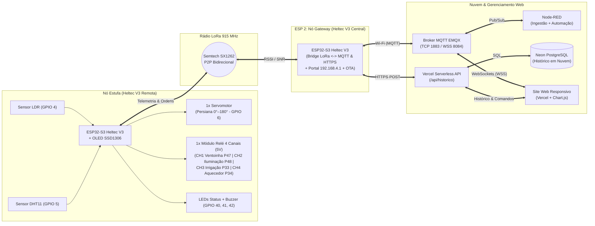

# SmartGreenhouse LoRa — Sistema IoT de Monitoramento e Automação de Estufa Remota

-blue?style=flat-square&logo=espressif)


Sistema completo de **Internet das Coisas (IoT)** para monitoramento microclimático e controle automatizado de uma **estufa agrícola remota** sem cobertura Wi-Fi local. O projeto utiliza dois microcontroladores **ESP32-S3 LoRa 915 MHz (Heltec WiFi LoRa 32 V3)** operando em arquitetura *Nó Sensor/Atuador (ESP 1) $\leftrightarrow$ Gateway (ESP 2)*, integrados em tempo real via **Broker MQTT (`broker.emqx.io`)**, **API Serverless na Vercel (`/api/historico`)**, fluxos de automação em **Node-RED**, persistência histórica em **Banco de Dados Neon PostgreSQL** e uma **Aplicação Web de Gerenciamento Remoto**.

> **Universidade Federal de São Paulo (UNIFESP)** — Instituto de Ciência e Tecnologia (ICT - SJC)  
> **Disciplina:** Internet das Coisas (IdC) — Prof. Dr. Gabriel de Freitas Fernandes

---

## Sumário

1. [Visão Geral do Sistema](#visão-geral-do-sistema)
2. [Arquitetura de Comunicação](#arquitetura-de-comunicação)
3. [Funcionalidades e Modos de Operação](#funcionalidades-e-modos-de-operação)
   - [1. Modo Automático (Controle Local Resiliente)](#1-modo-automático-controle-local-resiliente)
   - [2. Modo Manual (Override Remoto pelo Site / Node-RED)](#2-modo-manual-override-remoto-pelo-site--node-red)
4. [Hardware e Pinagem (Nó Estufa — Heltec V3)](#hardware-e-pinagem-nó-estufa--heltec-v3)
5. [Protocolo de Mensagens (LoRa & MQTT)](#protocolo-de-mensagens-lora--mqtt)
   - [Pacotes LoRa (915 MHz)](#pacotes-lora-915-mhz)
   - [Tópicos MQTT](#tópicos-mqtt)
6. [Estrutura do Repositório](#estrutura-do-repositório)
7. [Fluxo de Trabalho Git e Automação de Pull Requests](#fluxo-de-trabalho-git-e-automação-de-pull-requests)
8. [Como Executar o Projeto](#como-executar-o-projeto)
9. [Integrantes e Divisão de Responsabilidades](#integrantes-e-divisão-de-responsabilidades)

---

## Visão Geral do Sistema

Estufas de cultivo frequentemente estão afastadas de pontos de acesso Wi-Fi. Para contornar essa limitação e garantir alta confiabilidade, o **SmartGreenhouse LoRa** organiza a solução em três camadas:

1. **Nó Estufa — ESP 1 (ESP32-S3 Heltec WiFi LoRa 32 V3 — Remoto):** Instalado na estufa sem necessidade de internet local. Realiza a leitura contínua de **luminosidade (LDR no GPIO 4)** e **temperatura e umidade do ar (DHT11 no GPIO 5)**, exibe o diagnóstico no **Display OLED SSD1306 integrado**, controla o ângulo da **persiana via 1 servomotor (GPIO 6)**, aciona **1 Módulo Relé de 4 Canais 5V (nos GPIOs 47, 48, 33 e 34)** (Ventoinha 5V de exaustão, iluminação de cultivo, bomba de irrigação e aquecedor) e sinaliza status localmente (**LEDs Verde/Vermelho com resistores de 1 kΩ e Buzzer**). Transmite telemetria via **LoRa 915 MHz** a cada 5s (e imediatamente após executar qualquer comando recebido do ESP 2) e mantém controle autônomo local (*fail-safe*).
2. **Nó Gateway — ESP 2 (ESP32-S3 Heltec WiFi LoRa 32 V3 — Central):** Localizado na sede com conexão Wi-Fi 2.4 GHz. Recebe os pacotes LoRa em 915 MHz vindos do ESP 1 (via transceptor Semtech SX1262), afere a qualidade do enlace de rádio (`RSSI` em dBm e `SNR` em dB) e encaminha os dados simultaneamente para o **Broker MQTT (`broker.emqx.io`)** e via **HTTPS POST para a API Serverless da Vercel (`/api/historico`)**. No sentido inverso, recebe ordens enviadas pelo Site Web ou Node-RED e as transmite imediatamente via **LoRa 915 MHz** para o ESP 1. Conta ainda com portal web local (`Gateway_LoRa_V3` $\rightarrow$ `http://192.168.4.1`) para configuração dinâmica de Wi-Fi/MQTT e suporte a **atualização remota de firmware (ArduinoOTA)**.
3. **Nuvem, Banco de Dados e Site Web:**
   * **API Serverless Vercel (`api/historico.js`) + Neon PostgreSQL:** Cria automaticamente as tabelas `historico_estufa` e `comandos_estufa`, armazena a série temporal completa de leituras/estados e enfileira comandos remotos para o Gateway.
   * **Node-RED (`nuvem_nodered/flows_estufa.json`):** Orquestra a ingestão dos pacotes MQTT, formata payloads para o banco SQL e disponibiliza botões de injeção de comandos.
   * **Site Web de Controle (`web/`):** Interface web responsiva hospedada na **Vercel** (e executável localmente), conectada em tempo real via **MQTT over WebSockets (`wss://broker.emqx.io:8084/mqtt`)** e integrada à API `/api/historico` para exibição de gráficos históricos (Chart.js) e tabela de registros.

---

## Arquitetura de Comunicação


```mermaid
flowchart LR
    subgraph Estufa["Nó Estufa (Heltec V3 Remota)"]
        direction TB
        LDR["Sensor LDR (GPIO 4)"] --> ESP_EST["ESP32-S3 Heltec V3\n+ OLED SSD1306"]
        DHT["Sensor DHT11 (GPIO 5)"] --> ESP_EST
        ESP_EST --> SERVO["1x Servomotor\n(Persiana 0°–180° - GPIO 6)"]
        ESP_EST --> RELES["1x Módulo Relé 4 Canais (5V)\n(CH1 Ventoinha P47 | CH2 Iluminação P48 |\nCH3 Irrigação P33 | CH4 Aquecedor P34)"]
        ESP_EST --> ALARME["LEDs Status + Buzzer (GPIO 40, 41, 42)"]
    end

    subgraph Enlace["Rádio LoRa 915 MHz"]
        RF(("Semtech SX1262\nP2P Bidirecional"))
    end

    subgraph Gateway["ESP 2: Nó Gateway (Heltec V3 Central)"]
        ESP_GW["ESP32-S3 Heltec V3\n(Bridge LoRa <-> MQTT & HTTPS\n+ Portal 192.168.4.1 + OTA)"]
    end

    subgraph Cloud["Nuvem & Gerenciamento Web"]
        BROKER["Broker MQTT EMQX\n(TCP 1883 / WSS 8084)"]
        API["Vercel Serverless API\n(/api/historico)"]
        NODERED["Node-RED\n(Ingestão + Automação)"]
        DB[("Neon PostgreSQL\n(Histórico em Nuvem)")]
        SITE["Site Web Responsivo\n(Vercel + Chart.js)"]
    end

    ESP_EST <==>|"Telemetria & Ordens"| RF
    RF <==>|"RSSI / SNR"| ESP_GW
    ESP_GW <==>|"Wi-Fi (MQTT)"| BROKER
    ESP_GW <==>|"HTTPS POST"| API
    API <==>|"SQL"| DB
    BROKER <==>|"Pub/Sub"| NODERED
    BROKER <==>|"WebSockets (WSS)"| SITE
    API <==>|"Histórico & Comandos"| SITE
```

---

## Funcionalidades e Modos de Operação

### 1. Modo Automático (Controle Local Resiliente)
O Nó Estufa avalia continuamente os sensores a cada ciclo curto (~600 ms para LDR e 2 s para DHT11) e atua autonomamente:

* **Controle do Servomotor da Persiana (GPIO 6) em Resposta à Luz (LDR):**
  * **Escuro / Tampando o LDR (`Luz < 25%`):** Persiana fecha em **`0°` (Fechada)** para isolamento térmico e **LIGA o Relé 2 (Iluminação de Cultivo)** para suplementação luminosa.
  * **Luz Ambiente Normal (`25% <= Luz <= 75%`):** Persiana abre em **`90°` (Aberta)** para máximo aproveitamento da luz solar e ventilação natural, **DESLIGANDO o Relé 2**.
  * **Sol Muito Forte / Lanterna no LDR (`Luz > 75%`):** Persiana inclina para **`160°` (Sombreamento)** para proteger as plantas contra insolação excessiva e queima de folhas.
* **Controle do Módulo Relé de 4 Canais 5V (Lado do Pino 47):**
  * **Canal 1 (`IN1`) — Ventoinha 5V (Exaustor / Refrigeração):** Liga quando `Temperatura > 28 °C` ou `Umidade > 80%`.
  * **Canal 2 (`IN2`) — Iluminação Artificial (Cultivo):** Liga automaticamente quando `Luz < 25%`.
  * **Canal 3 (`IN3`) — Bomba de Irrigação / Nebulização:** Liga quando `Umidade < 45%`.
  * **Canal 4 (`IN4`) — Aquecedor Térmico:** Liga quando `Temperatura < 18 °C`.
* **Alarme Audiovisual Local (Buzzer + LEDs):**
  * **LED Verde (GPIO 41):** Aceso contínuo durante operação normal.
  * **LED Vermelho (GPIO 40) + Buzzer (GPIO 42):** Acionados em caso de emergência climática (`Temperatura >= 35 °C`), forçando a Ventoinha (Relé 1) a ligar e transmitindo status de alerta via LoRa/MQTT.
  * O Buzzer também emite bipes curtos de aviso ao movimentar a persiana.

### 2. Modo Manual (Override Remoto pelo Site / Node-RED)
Através do painel web ou do Node-RED, o operador pode assumir o controle a qualquer momento:
* Ajuste do ângulo da persiana ($0^\circ$ a $180^\circ$) por *slider* ou atalhos rápidos (*Fechar 0°*, *Meia-Luz 45°*, *Abrir 90°*, *Sombra 160°*).
* Acionamento manual e individual dos 4 Relés (Ventoinha, Iluminação de Cultivo, Irrigação, Aquecedor).
* Inversão rápida da lógica de disparo dos relés (`Ativo em HIGH` $\leftrightarrow$ `Ativo em LOW`).
* Silenciamento temporário (*Mute*) ou teste manual do Buzzer.
* Reprogramação remota dos limiares de acionamento do modo automático.

---

## Hardware e Pinagem (Nó Estufa — Heltec V3)

O circuito do Nó Estufa foi dimensionado para a placa **Heltec WiFi LoRa 32 V3 (ESP32-S3)** com transceptor **Semtech SX1262 (915 MHz)** e **Display OLED SSD1306 integrado**.

| Periférico / Sensor | Pino na Heltec V3 | Tipo de Interface | Função no Sistema |
| :--- | :---: | :---: | :--- |
| **LoRa Semtech SX1262** | `NSS=8, SCK=9, MOSI=10, MISO=11, RST=12, BUSY=13, DIO1=14` | SPI Dedicado | Comunicação rádio LoRa 915 MHz |
| **Display OLED SSD1306 (128x64)** | `SDA=17, SCL=18, RST=21, Vext=36` | I2C Interno | Exibição local de IP, sensores, persiana, relés e LoRa |
| **LED Onboard Branco** | `GPIO 35` | Saída Digital | Indicação de atividade dos relés e pacotes LoRa |
| **Botão PRG / BOOT** | `GPIO 0` | Entrada com Pull-up | Alterna manualmente entre modo AUTO e MANUAL na bancada |
| **Sensor LDR (Luminosidade)** | `GPIO 4` | Entrada Analógica (ADC1) | Divisor de tensão com resistor de $10\text{ k}\Omega$ para medição de luz (%) |
| **Sensor DHT11 (Temp. e Umidade)** | `GPIO 5` | Digital One-Wire | Medição de temperatura (°C) e umidade relativa (%) |
| **Servomotor da Persiana** | `GPIO 6` | Saída PWM (50 Hz) | Controle do ângulo das aletas da persiana ($0^\circ$ a $180^\circ$) |
| **Relé 4 Canais (`CH1`) — Ventoinha 5V** | `GPIO 47` | Saída Digital | Aciona a **Ventoinha 5V** (Exaustor no contato `NA` do canal 1) |
| **Relé 4 Canais (`CH2`) — Iluminação** | `GPIO 48` | Saída Digital | Aciona a **Iluminação Artificial** (Cultivo no canal 2) |
| **Relé 4 Canais (`CH3`) — Irrigação** | `GPIO 33` | Saída Digital | Aciona a **Bomba de Irrigação / Válvula** (canal 3) |
| **Relé 4 Canais (`CH4`) — Aquecedor** | `GPIO 34` | Saída Digital | Aciona o **Aquecedor Térmico** (canal 4) |
| **Buzzer de Alerta** | `GPIO 42` | Saída Digital | Alarme sonoro local de emergência e movimentação |
| **LED Status Verde** | `GPIO 41` | Saída Digital | Indicação visual de operação normal |
| **LED Status Vermelho** | `GPIO 40` | Saída Digital | Indicação visual de alarme crítico |

> **Nota de Alimentação dos 4 Relés e GND Comum:** Os módulos Relé de 5V devem ter `VCC` alimentado em `+5V` e o pino **`GND` obrigatoriamente interligado ao `GND` do ESP32 (Terra Comum)** para que o sinal lógico de `3.3V` seja referenciado corretamente. Na borneira de potência de cada relé, o `+5V` entra no terminal `COM` e o fio positivo da carga (ex.: Ventoinha) sai do terminal **`NA` (Normalmente Aberto)**.

---

## Protocolo de Mensagens (LoRa & MQTT)

### Pacotes LoRa (915 MHz)
* **Telemetria (ESP 1 Estufa $\rightarrow$ ESP 2 Gateway a cada 5s e após comandos):**
  ```json
  {"id":"EST01","seq":301,"t":28.9,"h":48.0,"l":83,"adc":3421,"srv":160,"r":[1,0,0,0],"al":0,"buz":1,"inv":0,"dht":1,"m":"AUTO"}
  ```
  *(Onde: `t` = Temp °C, `h` = Umidade %, `l` = Luz %, `adc` = Leitura ADC bruta do LDR, `srv` = Ângulo do servo, `r` = Estado dos 4 Relés R1..R4 nos pinos 47/48/33/34, `al` = Alarme, `buz` = Buzzer ativo, `inv` = Lógica invertida, `dht` = Status do DHT11, `m` = Modo).*
* **Comando de Atuação (ESP 2 Gateway $\rightarrow$ ESP 1 Estufa sob demanda):**
  ```json
  {"target":"EST01","cmd":"SET","m":"MAN","srv":45,"ch":0,"state":1,"buz":1,"inv":0}
  ```
* **Configuração de Limiares (ESP 2 Gateway $\rightarrow$ ESP 1 Estufa):**
  ```json
  {"target":"EST01","cmd":"CFG","tMax":28.0,"tMin":18.0,"tCrit":35.0,"hMin":45.0,"lMin":25,"lMax":75}
  ```

### Tópicos MQTT
> Broker padrão configurado: `broker.emqx.io` (`TCP 1883` no ESP 2 e `WSS 8084` no Site Web).
| Tópico | Direção | Descrição |
| :--- | :---: | :--- |
| `unifesp/iot/estufa/telemetria` | `ESP 2 Gateway -> Nuvem` | Payload JSON completo da estufa acrescido de `rssi`, `snr`, `gwId` e `gwRx` |
| `unifesp/iot/estufa/gateway/status` | `ESP 2 Gateway -> Nuvem` | Heartbeat do Gateway com IP Wi-Fi, RSSI Wi-Fi, contadores LoRa/Vercel e uptime |
| `unifesp/iot/estufa/comando` | `Site / Nuvem -> ESP 2` | Comando JSON unificado (`SET`, `CFG` ou `PING`) encaminhado via LoRa ao ESP 1 |
| `unifesp/iot/estufa/comando/modo` | `Site / Nuvem -> ESP 2` | Define o modo de operação (`"AUTO"` ou `"MAN"`) |
| `unifesp/iot/estufa/comando/persiana` | `Site / Nuvem -> ESP 2` | Define o ângulo da persiana (`0` a `180`) |
| `unifesp/iot/estufa/comando/reles` | `Site / Nuvem -> ESP 2` | Aciona individualmente um dos 4 Relés (`{"ch":0,"state":1}`) |
| `unifesp/iot/estufa/comando/config` | `Site / Nuvem -> ESP 2` | Reconfigura setpoints de automação remotamente |

---

## Estrutura do Repositório

```text
projeto-IOT/
├── .github/
│   ├── workflows/
│   │   ├── pr-code-review.yml          # CI e Code Review Automatizado nos Pull Requests
│   │   └── enforce-branch-protection.yml
│   └── PULL_REQUEST_TEMPLATE.md
├── .githooks/                          # Hooks Git que bloqueiam commits diretos em main/develop
│   ├── pre-commit
│   └── pre-push
├── api/
│   └── historico.js                    # API Serverless Vercel (GET/POST Neon PostgreSQL + Fila de Comandos)
├── firmware/
│   ├── no_estufa_lora/
│   │   └── no_estufa_lora.ino          # Firmware do ESP 1: Nó Estufa (Heltec V3 + 4 Relés 47/48/33/34 + Servo + Sensores)
│   ├── no_gateway_lora_mqtt/
│   │   └── no_gateway_lora_mqtt.ino    # Firmware do ESP 2: Nó Gateway (Heltec V3 + LoRa <-> MQTT/Vercel + OTA)
│   └── teste_hardware_lora_wifi_oled/
│       └── teste_hardware_lora_wifi_oled.ino # Diagnóstico completo de bancada (SX1262 + OLED + AP)
├── web/                                # Site de Gerenciamento Remoto (Vercel + MQTT over WebSockets)
│   ├── index.html
│   ├── css/
│   │   └── styles.css
│   └── js/
│       └── app.js
├── nuvem_nodered/
│   ├── flows_estufa.json               # Fluxos exportados do Node-RED
│   └── schema_banco.sql                # Script SQL das tabelas historico_estufa e comandos_estufa
├── pci_hardware/
│   ├── README.md
│   └── lista_materiais_BOM.md          # Lista de componentes da PCI (2x Módulos Relé Duplos, etc.)
├── encapsulamento_3d/
│   └── README.md                       # Modelos 3D (.STL) do encapsulamento
├── docs/
│   └── evidencias/
│       └── README.md                   # Fotos e vídeos de validação
├── scripts/
│   └── configure-branch-protection.ps1 # Script para ativar hooks e proteção de branch
├── package.json                        # Dependências da API Serverless (@neondatabase/serverless)
├── vercel.json                         # Regras de roteamento da Vercel para /web e /api/historico
└── README.md
```

---

## Fluxo de Trabalho Git e Automação de Pull Requests

Este repositório conta com automação de governança (`.githooks/` e **GitHub Actions**) que **bloqueia commits diretos nas branches `main` e `develop`**. Todo desenvolvimento deve seguir o fluxo abaixo:

1. **Ative os hooks locais após clonar (uma única vez):**
   ```powershell
   ./scripts/configure-branch-protection.ps1
   ```
2. **Crie uma branch separada a partir da `develop`:**
   ```bash
   git checkout develop
   git pull origin develop
   git checkout -b feature/minha-funcionalidade
   ```
3. **Faça seus commits e envie sua branch para o GitHub:**
   ```bash
   git add .
   git commit -m "feat: implementa controle do servo via LDR"
   git push -u origin feature/minha-funcionalidade
   ```
4. **Abra um Pull Request para a branch `develop`:**
   * O workflow **`Automated Code Review & Validation`** executará automaticamente a verificação de código e comentará o relatório no PR.
   * **Requisito de Merge:** O PR só poderá ser integrado à `develop` após passar no Code Review automatizado **e** receber a aprovação (**Approve**) de pelo menos **1 outro integrante do grupo**.

---

## Como Executar o Projeto

1. **Bibliotecas Necessárias (Arduino IDE):**
   * No Gerenciador de Bibliotecas da Arduino IDE, instale:
     * **`RadioLib`** (por Jan Gromes) — suporte ao chip LoRa Semtech SX1262
     * **`Adafruit SSD1306`** e **`Adafruit GFX Library`** — display OLED integrado
     * **`DHT sensor library`** (por Adafruit) e **`Adafruit Unified Sensor`**
     * **`ESP32Servo`** (por Kevin Harrington / John K. Bennett)
     * **`ArduinoJson`** (por Benoit Blanchon)
     * **`PubSubClient`** (por Nick O'Leary)
2. **Gravação do Firmware:**
   * Em **Ferramentas $\rightarrow$ Placa**, selecione **`Heltec WiFi LoRa 32(V3)`** (ou `ESP32S3 Dev Module`).
   * Grave `no_estufa_lora.ino` no **ESP 1 (Estufa)** e `no_gateway_lora_mqtt.ino` no **ESP 2 (Gateway)**.
3. **Painéis Web de Validação e Configuração Local na Bancada (`192.168.4.1`):**
   * **ESP 1 (Estufa):** Cria a rede Wi-Fi **`Estufa_LoRa_V3`** (senha: **`12345678`**). Acessando **`http://192.168.4.1`**, é possível testar localmente o servomotor, os 2 módulos Relé duplos (`P47`, `P48`, `P33`, `P34`) e os sensores.
   * **ESP 2 (Gateway):** Cria a rede Wi-Fi **`Gateway_LoRa_V3`** (senha: **`12345678`**). Acessando **`http://192.168.4.1`**, é possível configurar o nome/senha do Wi-Fi 2.4 GHz da bancada, o host do Broker MQTT e a URL da Vercel sem precisar regravar o código.
4. **Banco de Dados Neon PostgreSQL, Vercel e Node-RED (`api/` e `nuvem_nodered/`):**
   * Na Vercel, conecte o banco **Neon PostgreSQL** (variável `DATABASE_URL`). O endpoint `/api/historico` criará automaticamente as tabelas `historico_estufa` e `comandos_estufa` (também documentadas em `nuvem_nodered/schema_banco.sql`).
   * No Node-RED, importe o arquivo `flows_estufa.json` para monitorar os tópicos MQTT em `broker.emqx.io`.
5. **Site de Gerenciamento Remoto (`web/`):**
   * Acesse pela URL da **Vercel** (ou abra `web/index.html` diretamente no navegador) para visualizar os sensores, o link LoRa (`RSSI`/`SNR`) e os gráficos históricos em tempo real, além de controlar remotamente a persiana e os 4 relés do ESP 1 através do ESP 2.

---

## Integrantes e Divisão de Responsabilidades

| Frente / Etapa do Projeto | Descrição das Entregas sob Responsabilidade | Nome do(a) Integrante | RA | GitHub |
| :--- | :--- | :---: | :---: | :---: |
| **1. Hardware, Circuito e PCI** | Validação em protoboard, esquemático elétrico, confecção da Placa de Circuito Impresso (PCI) e modelagem do encapsulamento 3D | *[Inserir Nome]* | *[Inserir RA]* | `@usuario` |
| **2. Firmware Nó Estufa & LoRa** | Código do ESP32 LoRa #1 (`no_estufa_lora.ino`), leitura de sensores (DHT11/LDR), controle do Servo/4 Relés/Buzzer e protocolo LoRa 915 MHz | *[Inserir Nome]* | *[Inserir RA]* | `@usuario` |
| **3. Firmware Nó Gateway & OTA** | Código do ESP32 LoRa #2 (`no_gateway_lora_mqtt.ino`), ponte LoRa $\leftrightarrow$ Wi-Fi/MQTT, leitura de RSSI/SNR e atualização remota (OTA) | *[Inserir Nome]* | *[Inserir RA]* | `@usuario` |
| **4. Nuvem (Node-RED), Banco & Web** | Fluxos do Node-RED (`flows_estufa.json`), banco de dados histórico (`schema_banco.sql`) e site de controle remoto (`web/`) | *[Inserir Nome]* | *[Inserir RA]* | `@usuario` |
